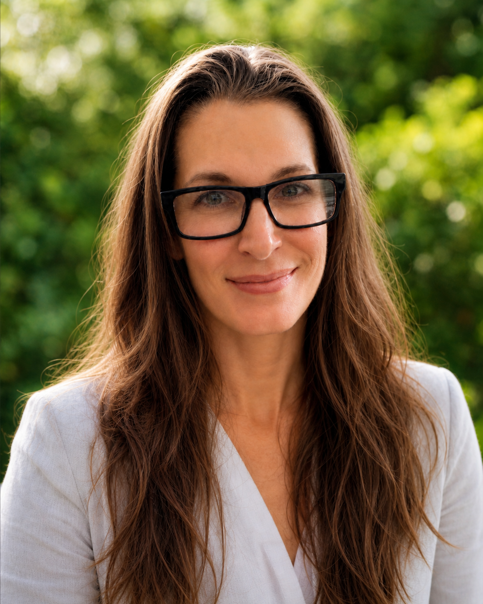

::: {.about-page}

{.headshot fig-alt="Headshot of Jodie Wiggins"}

```{=html}
<div class="opening-quote">
  There is no knowledge that is not power.
  <div class="opening-quote__cite">— Ralph Waldo Emerson</div>
</div>
```

```{=html}
<div class="pull-quote">Making the power that is inherent in knowledge accessible is what I do.</div>
```
My background is in genetics and evolutionary biology, specifically, a PhD plus over a decade of university teaching, but what I actually spend my time on is harder to categorize: designing the structures that help people understand genuinely difficult things. That might mean a flipped course that took a 39% failure rate to under 5%. Or a cross-disciplinary educator workshop that succeeded so thoroughly it surprised the people who commissioned it. Or a suite of original videos, active learning sessions, and assessment frameworks built from scratch because the existing materials weren't good enough.

I think carefully about where people get lost and I design backward from that. I'm most useful when the problem is *we have complex information and the people who need it aren't getting it.* That could be a content problem, a structure problem, or sometimes a trust problem. The core of addressing all three is curiosity. 

```{=html}
<div class="pull-quote">Curiosity is my superpower.</div>
```

## Training and tools

I hold a PhD in integrative biology, working in genetics and evolutionary biology, and have over a decade of university teaching at Oklahoma State where I'm currently a Teaching Associate Professor. I also taught K–12 science for three years before that. I read the discipline-based education research literature. It is difficult to narrow down who to mention but [Eyler](https://wvupressonline.com/node/758), [Ambrose et al.](https://books.google.com/books/about/How_Learning_Works.html?id=gu5qpi5aFDkC), [Blum](https://wvupressonline.com/ungrading), [Theobald et al.](https://www.pnas.org/doi/10.1073/pnas.1916903117), [McGuire](https://www.routledge.com/Teach-Students-How-to-Learn-Strategies-You-Can-Incorporate-Into-Any-Course/McGuire/p/book/9781620363164), and [Lang](https://www.wiley.com/en-us/Small+Teaching%3A+Everyday+Lessons+from+the+Science+of+Learning%2C+2nd+Edition-p-9781119755548) tend to sit at the top of the stack. I've continued my training in instructional design for adult learners, learning measurement, culturally responsive pedagogy (Smithsonian), open educational resources, science communication summits, and program management.

Technically, I'm fluent in R and Python — particularly for data visualization and analysis — and across the modern Markdown / Quarto / GitHub Pages publishing stack. I've coordinated research teams, led multi-section instructional operations at scale, and built educational programs from scratch.

## A snap shot

I rebuilt our 8-section General Genetics course from the ground up: flipped, OER-based, evidence-driven. Three years later, the results are still holding. I'm now leveraging that to redesign our Introductory Biology course.

```{=html}
<div class="big-stat-grid">
  <div class="big-stat">
    <div class="big-stat__numbers">
      <span class="big-stat__before">39%</span>
      <span class="big-stat__arrow">→</span>
      <span class="big-stat__after">&lt;5%</span>
    </div>
    <div class="big-stat__caption">Drop/fail/withdraw rate in General Genetics, before and after the redesign. Three consecutive years and counting.</div>
  </div>
  <div class="big-stat">
    <div class="big-stat__numbers">
      <span class="big-stat__after">2,000+</span>
    </div>
    <div class="big-stat__caption">Students per year in Introductory Biology — the next course on my redesign list.</div>
  </div>
</div>
```

Adjacent to that: I co-founded our department's Community of Practice, helped write [Safe Evolution](https://www.evolutionmeetings.org/safe-evolution.html) — the code of conduct for the Society for the Study of Evolution and partner societies — serve on our department's AI Integration Team, and mentor K–8 students at Prairie Wood Forest School.

Before higher ed I was a certified K–12 science teacher. Before that I was a kid who couldn't stop asking questions about how things worked.

## Why now

After a decade in academia, I want to do this work somewhere it lives closer to where scientific information actually meets people's lives. Medical communications. Scientific content strategy. Patient education. Editorial leadership.

```{=html}
<div class="pull-quote">Same skills, different impact.</div>
```

## A note on lived experience

I've also navigated the medical system as a complex patient — hEDS, MCAS, dysautonomia. The power of my knowledge saved my life. 

```{=html}
<div class="pull-quote">I understand, from the other side of the chart, what it costs when scientific information isn't accessible to the people who need it most.</div>
```

That perspective shapes how I write for patients, providers, and caregivers and the kind of work I want to do next.

## What I'm looking for

```{=html}
<div class="pull-quote">Roles where the work is substantive, the team is collaborative, and the mission is real.</div>
```

Full-time scientific content roles, content strategy and editorial leadership, freelance medical and patient communications — and conversations that don't fit any of those boxes.

[jodiewiggins18@gmail.com](mailto:jodiewiggins18@gmail.com) · [LinkedIn](https://www.linkedin.com/in/jodie-wiggins/)

:::
