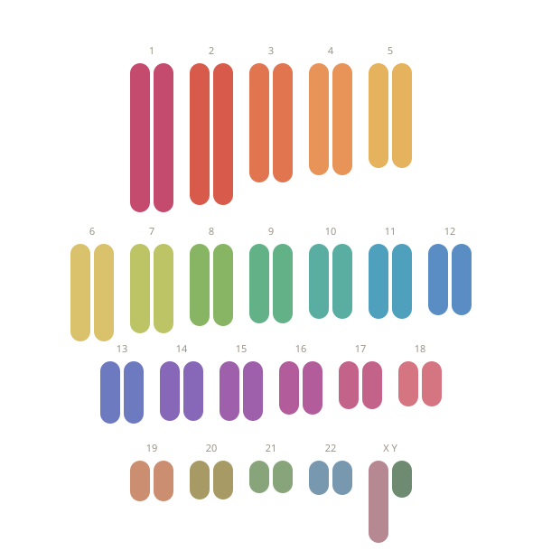

```{=html}
<section class="hero">
  
  <p class="hero__caption">A spectral karyotype paints each chromosome a different color so we can finally see what's there. The same principle applies to the rest of science.</p>
  <a href="#what-i-do" class="hero__scroll">scroll ↓</a>
</section>

<section class="do-band" id="what-i-do">
  <div class="do-band__inner">
    <p class="tagline">Science is the language of our health, our food, our environment and <em>everyone</em> deserves access to that language.</p>

    <p style="font-size: 1.12rem; line-height: 1.55; margin-bottom: 0;">I build content and learning systems for genuinely difficult things — and I measure whether they do what they're supposed to. PhD in biology, ten-plus years across university teaching, instructional design, scientific writing, and editorial leadership.</p>

    <ul class="do-list">
      <li><strong>Translate.</strong> Clinical and research science, rewritten for the people who actually use it — clinicians, patients, learners, advocates. Without flattening the uncertainty that's really there.</li>
      <li><strong>Design.</strong> Content systems, review frameworks, and editorial workflows that scale without losing rigor. I've built ones that work for two students and ones that work for two thousand.</li>
      <li><strong>Lead.</strong> Teams, courses, and high-stakes scientific communication, end to end. I'm the person you call when a sentence is wrong, and the person who can explain why.</li>
    </ul>
  </div>
</section>

<section class="work-section">
  <div class="work-section__inner">
    <h2>Featured work</h2>

    <a href="work/genetics-course-redesign.html" class="work-card">
      <div class="work-card__meta">Course redesign · Higher education</div>
      <h3 class="work-card__title">Redesigning a failing course</h3>
      <p class="work-card__teaser">A flipped, OER-based rebuild of General Genetics that took the drop/fail/withdraw rate from 39% to under 5% — and held there for three consecutive years.</p>
    </a>

    <a href="work/phylogenetics-education-program.html" class="work-card">
      <div class="work-card__meta">Program design &amp; launch · Federally-funded research initiative</div>
      <h3 class="work-card__title">Building an education program from nothing</h3>
      <p class="work-card__teaser">An education and outreach division for a federally-funded phylogenetics initiative — including a researcher-educator workshop model whose results surprised the people who commissioned it.</p>
    </a>

    <p style="margin-top: 2.5rem; font-size: 0.95rem;"><a href="work/index.html">See all work →</a></p>
  </div>
</section>

<footer class="site-footer">
  <a href="mailto:jodiewiggins18@gmail.com">jodiewiggins18@gmail.com</a> ·
  <a href="https://www.linkedin.com/in/jodie-wiggins/" target="_blank" rel="noopener">LinkedIn</a> ·
  <a href="about.html">The Details</a>
</footer>
```
