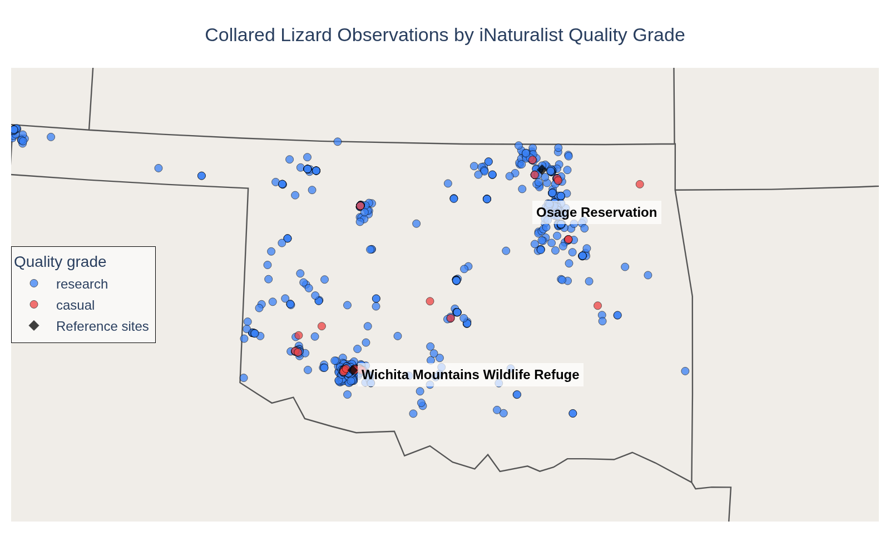
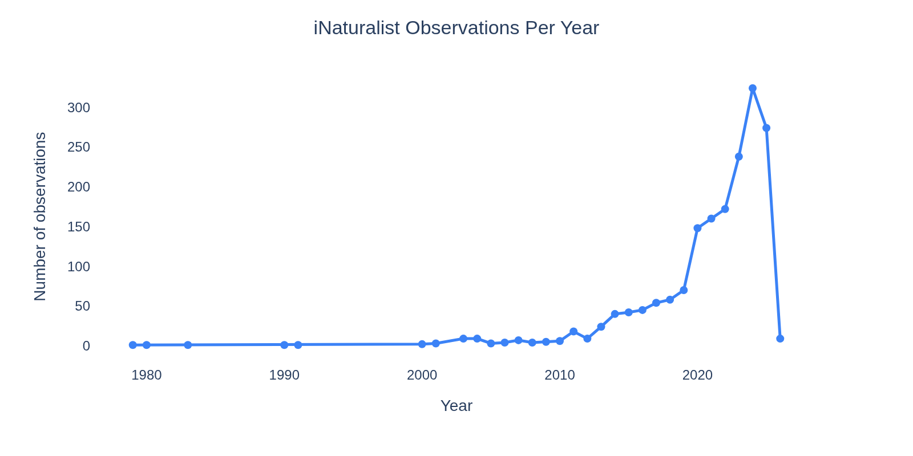

```{=html}
<article class="case-study">

  <header class="case-study__header">
    <div class="case-study__kicker">Data analysis · Public dataset · Biodiversity &amp; spatial data</div>
    <h1 class="case-study__title">Mapping <em>Crotaphytus collaris</em> sightings in Oklahoma</h1>
    <p class="case-study__dek">A spatial analysis of iNaturalist observations of the Eastern Collared Lizard. Where are sightings concentrated, and how much of that pattern reflects the animal's actual distribution versus where people go?</p>
    <ul class="case-skills">
      <li>iNaturalist Observations API</li>
      <li>Spatial data analysis</li>
      <li>Sampling bias in observational data</li>
      <li>Python · pandas · Plotly</li>
      <li>Reproducible reporting (Quarto)</li>
    </ul>
  </header>

  <section class="case-study__section">
    <h2>Why this question</h2>
    <p>Species occurrence datasets are frequently used to infer distribution, model habitat, or flag conservation concern. But observational data — collected by volunteers submitting sightings — carries a structural problem: it reflects where people go, not just where animals are.</p>
    <p><em>The question:</em> where are iNaturalist sightings of <em>Crotaphytus collaris</em> concentrated in Oklahoma, and do the spatial patterns in the data match plausible biology — or something else?</p>
    <p>This is the entry point into a larger methodological question that matters for any analysis that treats citizen science data as a proxy for true distribution.</p>
  </section>

  <section class="case-study__section">
    <h2>The data</h2>
    <p>Observations pulled from the <strong>iNaturalist Observations API</strong> — filtered to <em>Crotaphytus collaris</em> in Oklahoma, research grade and casual observations included. Records span 1979–2026, though meaningful data density begins in the 2010s as iNaturalist adoption grew.</p>
    <p>The dataset was fetched programmatically, flattened from JSON to CSV, and cleaned prior to mapping: coordinate missingness removed, captive/cultivated records excluded, date fields parsed. 1,759 georeferenced observations total; 1,735 (98.6%) carry research grade status.</p>
  </section>

  <section class="case-study__section">
    <h2>What the map shows</h2>
    <p>The basic observation map reveals two clear clusters: one in the southwest corner of the state centered on the Wichita Mountains Wildlife Refuge, and one in the northeast centered on the Osage Reservation. Both are well-known wildlife areas with regular visitor traffic and active naturalist communities.</p>

    <div style="margin: 2rem 0; text-align: center;">
      
    </div>

    <p>The near-total dominance of research-grade observations (98.6%) tells its own story: these are sightings confirmed by the community, with photos and identifications. That's a meaningful data quality filter — but it also means the dataset is shaped by where identification-ready naturalists go, not just where lizards live.</p>
  </section>

  <section class="case-study__section">
    <h2>What I expected to find — and what the data said</h2>
    <p>I wrote the expected pattern before running the analysis.</p>
    <p><em>What I expected:</em> sightings concentrated in the western half of the state, which represents the eastern extent of the species' documented range; some cluster around the Wichita Mountains, which are a known stronghold; sparse coverage in the panhandle and north-central areas.</p>
    <p><em>What I found:</em> the western cluster confirmed — but the Osage Reservation cluster in the northeast was not what I predicted. The Osage Reservation sits near the northeastern edge of the species' range, but the sighting density there rivals the Wichita Mountains. That's likely a sampling artifact: the Osage is a major destination for wildlife photographers and birders, and observer effort, not lizard density, may be driving the signal.</p>
    <p>The interior of Oklahoma — large stretches of grassland and scrub habitat that likely support the species — shows almost no observations. Not because lizards aren't there, but because people aren't submitting sightings from there.</p>
  </section>

  <section class="case-study__section">
    <h2>Observations over time</h2>
    <p>The temporal pattern shows near-zero observations before 2010, then a steep rise as iNaturalist gained users — with a pronounced spike after 2015 and peak activity in the early 2020s.</p>

    <div style="margin: 2rem 0; text-align: center;">
      
    </div>

    <p>The pre-2010 observations are real occurrences entered retroactively — useful for historical context, but not comparable in density or spatial coverage to the modern data. Any trend analysis treating the full dataset as a continuous time series would be misleading. The growth in observations after 2015 reflects platform growth and user behavior as much as it reflects lizard population dynamics.</p>
  </section>

  <section class="case-study__section">
    <h2>Where the data stops being useful</h2>
    <p>This dataset can map where sightings occur. It cannot tell you where the species is absent, or what fraction of the Oklahoma population the observed individuals represent. Sighting absence in a grid cell is not the same as species absence — it may mean no observer visited with a camera and iNaturalist account.</p>
    <p>The research-grade filter improves data quality but narrows geographic coverage further: research grade requires corroboration by multiple users, which systematically favors locations with active observer communities. The filtering that makes the data more reliable also makes it less representative of the full range.</p>
  </section>

  <section class="case-study__section">
    <h2>What I'd dig into next</h2>
    <p><strong>GBIF comparison.</strong> iNaturalist feeds into GBIF, but GBIF also aggregates museum records, systematic surveys, and other sources. Comparing the two datasets would surface where observational coverage is likely insufficient and where museum records fill gaps.</p>
    <p><strong>Observer effort normalization.</strong> Dividing sighting counts by estimated observer effort (total iNaturalist observations of any species in the same area and period) would produce a corrected occurrence rate — reducing the confounding effect of popular wildlife areas.</p>
    <p><strong>Habitat overlay.</strong> Overlaying land cover or ecoregion data would let you ask whether the observed clustering matches habitat type or human access patterns — and where suitable-but-unsampled habitat exists.</p>
  </section>

  <section class="case-study__section">
    <h2>The code</h2>
    <p>Data fetched from the iNaturalist API, cleaned and mapped in Python. The fetch script and processed CSV are in the repository.</p>

    <pre><code class="language-python">import requests, json, time
import pandas as pd

BASE_URL = "https://api.inaturalist.org/v1/observations"

def fetch_observations(taxon_id, place_id, per_page=200):
    all_results = []
    page = 1
    while True:
        params = {
            "taxon_id": taxon_id,
            "place_id": place_id,
            "per_page": per_page,
            "page": page,
            "order": "desc",
            "order_by": "created_at"
        }
        r = requests.get(BASE_URL, params=params)
        data = r.json()
        results = data.get("results", [])
        if not results:
            break
        all_results.extend(results)
        if len(all_results) >= data["total_results"]:
            break
        page += 1
        time.sleep(1)
    return all_results

# Crotaphytus collaris taxon_id = 36226; Oklahoma place_id = 59
records = fetch_observations(taxon_id=36226, place_id=59)

rows = []
for obs in records:
    coords = obs.get("location", "").split(",")
    rows.append({
        "id": obs.get("id"),
        "observed_on": obs.get("observed_on"),
        "quality_grade": obs.get("quality_grade"),
        "latitude": float(coords[0]) if len(coords) == 2 else None,
        "longitude": float(coords[1]) if len(coords) == 2 else None,
        "common_name": obs.get("taxon", {}).get("preferred_common_name"),
        "captive": obs.get("captive"),
    })

df = pd.DataFrame(rows)
df.to_csv("inat_collared_lizard_oklahoma.csv", index=False)
</code></pre>

    <p style="margin-top: 1rem; font-size: 0.92rem; color: #7E7567;"><em>Data: iNaturalist Observations API, public endpoint, no registration required. Full fetch script and processed CSV available in the <code>data-portfolio/projects/lizard/</code> directory of this repository.</em></p>
  </section>

  <a class="case-study__back" href="./">← All work</a>

</article>
```
