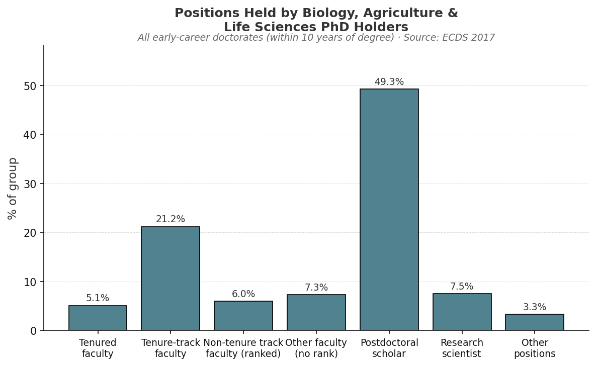
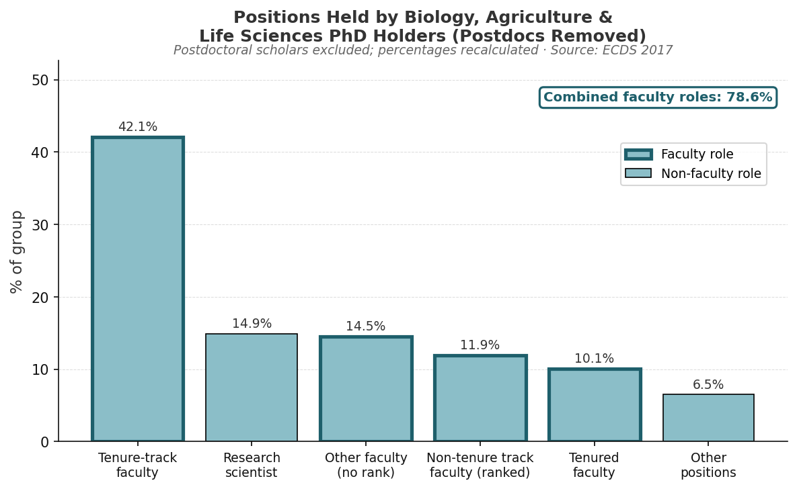

## Questions

- What jobs do life sciences PhDs hold within 10 years of graduation?
- What proportion of PhDs are in teaching-focused roles?
- How do actual career outcomes compare to initial post-graduation plans?

## Datasets
### Early Career Doctorates Survey (ECDS) [website](https://ncses.nsf.gov/surveys/early-career-doctorates/2017)

Summary from the ECDS site: "The ECDS gathers in-depth information about individuals who earned their first doctoral degree (PhD, MD, or equivalent) in the past 10 years and work at academic institutions and federally funded research and development centers (FFRDCs). Unique in scope, the ECDS includes professional and research doctorate holders from all fields trained in the United States and abroad. Sponsored by the National Center for Science and Engineering Statistics (NCSES) within the National Science Foundation and by the National Institutes of Health, the ECDS provides new data on the demographics, work experiences, and career paths of individuals in the first years following the completion of their doctoral studies."
Note: the only ECDS survey conducted to date was in 2017

Purpose:
- Primary dataset for analyzing job activities (teaching, research, management)
- Focuses on individuals within 10 years of earning a PhD

Use in this project:
- Identify proportion of PhDs in teaching vs research roles
- Analyze alignment between training and job responsibilities

Citation: 
National Center for Science and Engineering Statistics (NCSES). 2021. Early Career Doctorates: 2017. NSF 21-323. Alexandria, VA: National Science Foundation. Available at https://ncses.nsf.gov/pubs/nsf21323/.

### Survey of Earned Doctorates

Source: National Science Foundation, National Center for Science and Engineering Statistics

Purpose:
- Captures post-graduation plans at time of degree completion

Use in this project:
- Compare expected vs actual career outcomes

## Analyses

### Career Outcomes of Biology PhD Graduates

::: {layout-ncol=2}

:::

### Faculty Workload and Teaching Expectations

Among biology, agriculture, and life sciences PhD holders in the ECDS sample, 78.6% hold some form of faculty position when postdoctoral scholars are excluded. Understanding what those roles actually demand — and how well doctoral training prepares people for them — requires looking at how faculty time is typically allocated.

At research-intensive (R1) universities, the most commonly cited workload model assigns 40% of effort to teaching, 40% to research, and 20% to service, often referred to as the 40-40-20 model. This benchmark appears in faculty policy documents across major research universities ([Kansas State University](https://www.k-state.edu/provost/universityhb/fhxy.html); [University of Texas at Austin](https://cloud.wikis.utexas.edu/wiki/spaces/coe/pages/79168137/Tenured+Tenure-Track+Faculty+Workload+Policy+-+COE)) and is broadly consistent with findings from the [HERI Faculty Survey](https://heri.ucla.edu/heri-faculty-survey/), which collects self-reported time allocation from faculty at institutions across the country. Some variation exists, teaching allocations at R1 institutions range from approximately 40–50% depending on discipline and department, but research and teaching are generally treated as co-equal responsibilities.

At master's-granting and baccalaureate institutions, the balance shifts substantially toward teaching, with estimates ranging from 60–80% or higher ([NCES National Study of Postsecondary Faculty](https://nces.ed.gov/statprog/handbook/nsopf.asp)).

Taken together, these benchmarks suggest that the large majority of biology PhD holders in faculty roles — regardless of institution type — spend a significant portion of their professional time teaching.

::: {.callout-note}
If 78.6% of academically-employed biology PhD holders hold faculty positions, and if even the most research-favorable workload model assigns 40% of effort to teaching, it is reasonable to conclude that a substantial share of biology doctoral graduates will spend ***at minimum*** 40% of their professional time in teaching roles.
:::

### Limitations

An important caveat applies to all figures drawn from the ECDS. The survey targets PhD holders who work at academic institutions and Federally Funded Research and Development Centers (FFRDCs) — it does not capture graduates who entered industry, non-FFRDC government positions, or careers outside of academia. This means the career outcome data presented here reflects the distribution of positions *among those already in academic settings*, and likely overstates the proportion of all biology PhD graduates who end up in faculty roles. The true fraction of graduates with substantial teaching responsibilities may be lower once non-academic career paths are accounted for.
