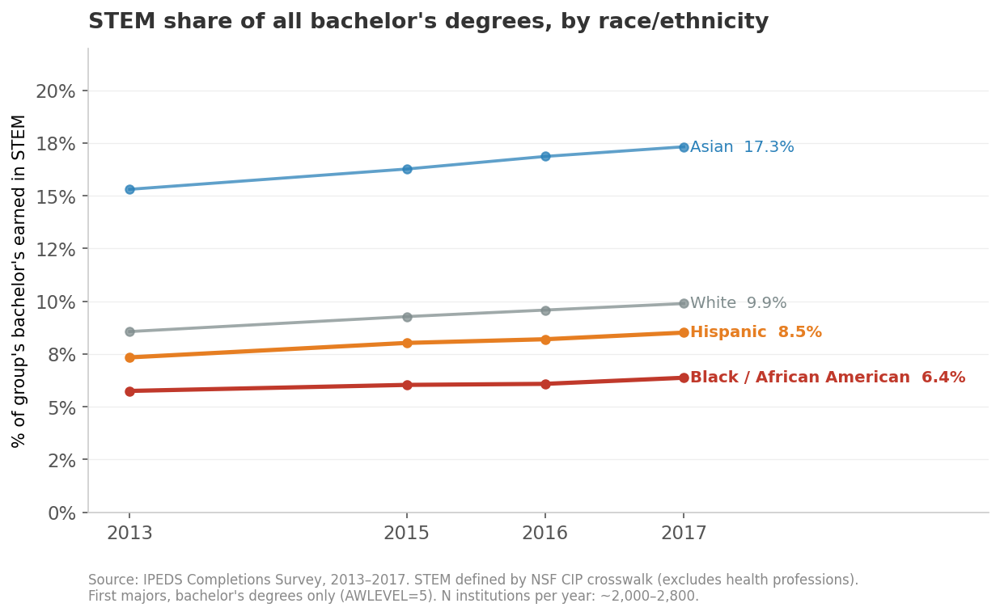
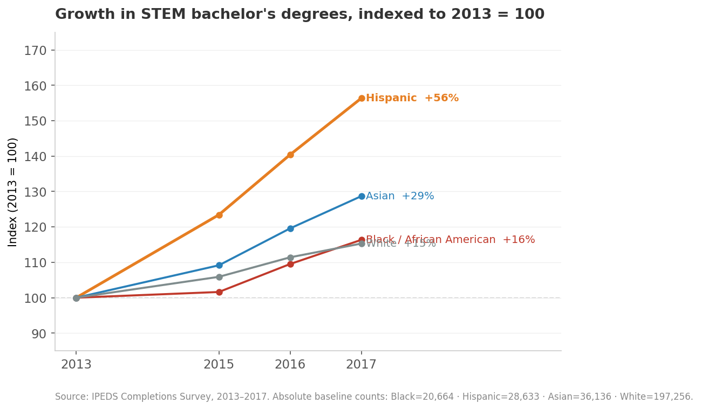
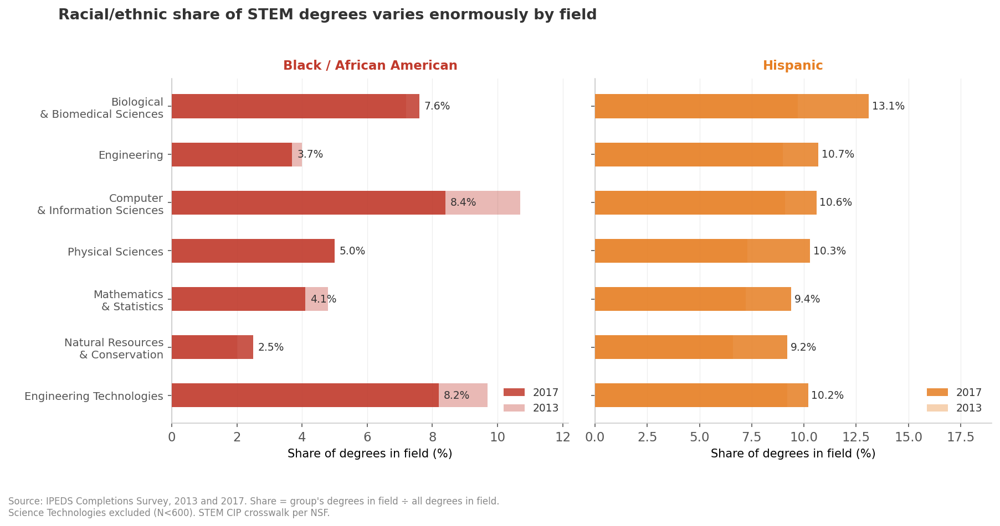
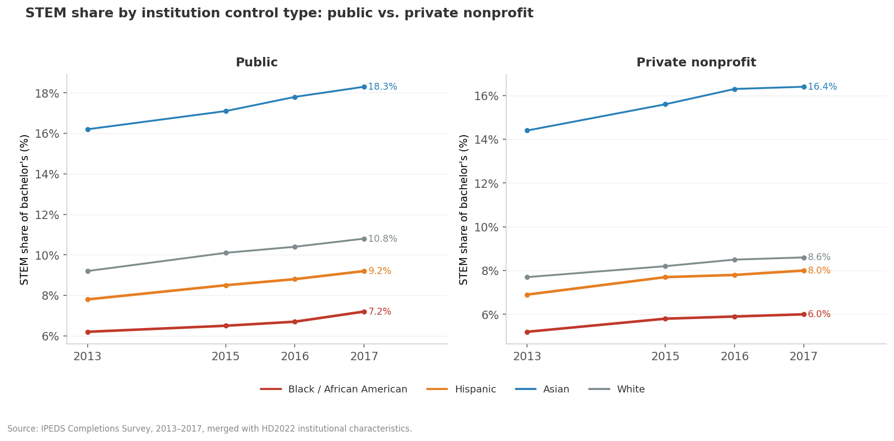

```{=html}
<article class="case-study">

  <header class="case-study__header">
    <div class="case-study__kicker">Data analysis · Public dataset · Higher education</div>
    <h1 class="case-study__title">What national data says about the STEM completion gap</h1>
    <p class="case-study__dek">A reproducible analysis of U.S. bachelor's degree completion in STEM fields using public IPEDS data. We know completion gaps exist. This analysis seeks to explore where the gap opens, who it traps, and what the institutional data can reliabily tell us about why.</p>
    <ul class="case-skills">
      <li>Public dataset (<a href="https://nces.ed.gov/ipeds/" target="_blank" rel="noopener">IPEDS / NCES</a>)</li>
      <li>Descriptive &amp; longitudinal analysis</li>
      <li>Equity-stratified outcomes</li>
      <li>Data wrangling at scale</li>
      <li>Python · pandas · matplotlib</li>
      <li>Reproducible reporting (Quarto)</li>
    </ul>
  </header>

  <section class="case-study__section">
    <h2>Why this question</h2>
    <p>I spent years redesigning single STEM gateway courses and watched what shifted when the design changed, and what didn't. That's the view from inside one classroom. The view from outside it at the level of every U.S. degree-granting institution, across almost a decade is what this analysis goes after.</p>
    <p><b>The question: </b><em>where in the STEM bachelor's degree pipeline does the equity gap sit, and how stable is the pattern across fields and institution types?</em> </p>
    <p>A gap reported as a single national number can obscure actionable nuance. A gap broken out by instructional programs (CIP field) and institution sector tells you where action can have impact and where the national average is smoothing informative variation.</p>
  </section>

  <section class="case-study__section">
    <h2>The data</h2>
    <p>All from the <strong>Integrated Postsecondary Education Data System (IPEDS)</strong>, maintained by the National Center for Education Statistics. Public, free, no registration required.</p>
    <ul>
      <li><strong>Completions (C_A survey)</strong> — degree counts by 6-digit CIP code, award level, race/ethnicity, and gender, by institution and year. Bachelor's degrees = <code>AWLEVEL=5</code>, first majors only (<code>MAJORNUM=1</code>).</li>
      <li><strong>Institutional Characteristics (HD)</strong> — sector, Carnegie classification, control type. The grouping variables that make the rest meaningful.</li>
    </ul>
    <p><strong>Scope:</strong> U.S. Title IV degree-granting institutions. Years: 2013, 2015–2017 (2014 data excluded — file truncated at row 253,038, reducing institution coverage by ~28%; the artifact produced a spurious one-year dip that is not a real trend). <strong>STEM definition:</strong> NSF STEM CIP crosswalk (2-digit families: 11, 14, 15, 26, 27, 40, 41, 03). Health professions (CIP 51) reported separately — including them substantially shifts the gendered patterns in the data.</p>
    <p>~2,600–2,800 institutions per year. ~78,000–82,000 institution × CIP × demographic rows per year after filtering to bachelor's level.</p>
  </section>

  <section class="case-study__section">
    <h2>What I expected to find — and what the data said</h2>
    <p>I wrote the expected pattern before running the analysis. Without that discipline, every result looks obvious in retrospect.</p>
    <p><em>What I expected:</em> overall STEM bachelor's counts rising; Black and Hispanic students underrepresented in STEM relative to their share of all bachelor's degrees; the gap larger and more stable in engineering and physical sciences than in biology or CS; a sector effect showing the gap concentrated at doctoral-granting institutions.</p>
    <p><em>What I found:</em> the first two confirmed, the third partially, the fourth not the way I expected.</p>
  </section>

  <section class="case-study__section">
    <h2>Finding 1: The gap is persistent, not closing</h2>
    <p>The core measure: STEM degrees as a share of each group's total bachelor's degrees earned. If a group earns 10% of all bachelor's in STEM, that 10% is their STEM share. It controls for differences in group size and total enrollment growth.</p>

    <div style="margin: 2rem 0; text-align: center;">
      
    </div>

    <p>Black students earned 5.7% of their bachelor's degrees in STEM in 2013. By 2017 that was 6.4% — a 0.7 percentage point gain over four years. White students went from 8.6% to 9.9% over the same period. The gap between Black and White STEM share was 2.9 percentage points in 2013 and 3.5 points in 2017. It grew while both numbers rose.</p>
    <p>Hispanic students fared somewhat better — 7.3% to 8.5%, tracking closer to White students — but still below. Asian students are consistently the highest at 15–17%, and rising.</p>
    <p>The trend lines are all moving in the same direction. That matters: it means overall STEM enrollment is expanding and pulling everyone along. It does not mean the gap is closing. The four lines are not converging.</p>
  </section>

  <section class="case-study__section">
    <h2>Finding 2: Who's actually driving the growth</h2>
    <p>Counts indexed to 2013 = 100 show how each group's STEM bachelor's production grew over the window.</p>

    <div style="margin: 2rem 0; text-align: center;">
      
    </div>

    <p>Hispanic STEM bachelor's completions grew 56% between 2013 and 2017, from 28,633 to 44,775 — nearly four times the rate for White students (+15%). Asian completions grew 29%. Black completions grew 16%, just barely outpacing White growth.</p>
    <p>The Hispanic growth is real and notable. It shows up in the STEM share chart too — the Hispanic line is the one actually closing distance on White. But even at +56% growth, Hispanic students started from a lower absolute base (28,633 in 2013 vs. 197,256 for White), and their STEM share in 2017 (8.5%) is still below the White rate in 2013 (8.6%).</p>
    <p>The Black growth story is the harder one: +16% raw growth over four years, but this is slightly above the overall STEM completion growth rate (~24%), so it isn't translating into a closing gap.</p>
  </section>

  <section class="case-study__section">
    <h2>Finding 3: The field-level breakdown is where the national average stops being useful</h2>
    <p>The aggregated STEM share hides enormous variation. Biology and computer science behave nothing like engineering and physical sciences.</p>

    <div style="margin: 2rem 0; text-align: center;">
      
    </div>

    <p>A few things stand out:</p>
    <p><strong>Computer science is the wrong kind of outlier.</strong> Black students had 10.7% of CS bachelor's in 2013 — the highest of any non-biology STEM field. By 2017 that had dropped to 8.4%, while the field as a whole grew 40%. CS added about 20,000 bachelor's degrees between 2013 and 2017; the share of those going to Black students fell. The field expanded and Black representation shrank within it.</p>
    <p><strong>Biology is the most diverse major STEM field by a wide margin.</strong> Black (7.6%) and Hispanic (13.1%) both have their highest representation in biological sciences by 2017, and the Hispanic number represents a significant gain from 9.7% in 2013. Biology is also the largest single STEM field by degree count (118,856 bachelor's in 2017), which makes this meaningful at scale.</p>
    <p><strong>Engineering is nearly unchanged.</strong> Black representation in engineering went from 4.0% in 2013 to 3.7% in 2017, while engineering added about 30,000 annual bachelor's degrees. Flat to declining share in a growing field.</p>
    <p><strong>Hispanic students are gaining across the board.</strong> Every field shows Hispanic growth from 2013 to 2017, with the largest gains in biology (+3.4 pp), physical sciences (+3.0 pp), and engineering (+1.7 pp).</p>
    <p>The field-level variation matters for interpreting the national number. "STEM" isn't one pipeline — it's seven substantially different ones, with substantially different representation patterns. An intervention designed for engineering won't transfer directly to biology, and vice versa.</p>
  </section>

  <section class="case-study__section">
    <h2>Finding 4: Public vs. private nonprofit — the sector effect is real but consistent</h2>

    <div style="margin: 2rem 0; text-align: center;">
      
    </div>

    <p>Public institutions show consistently higher STEM shares across all racial/ethnic groups — roughly 1–1.5 percentage points higher than private nonprofit institutions for Black and Hispanic students. This is partly a size effect: public institutions are larger, enroll more students, and tend to have more engineering programs. But the relative order of groups is the same at both sector types, and the gap between groups is similar.</p>
    <p>What this tells you: the equity gap is not primarily a sector artifact. The same pattern shows up whether you're looking at a public research university or a private liberal arts college. It's not explained by where students are enrolled.</p>
  </section>

  <section class="case-study__section">
    <h2>Where the data stops being able to answer the question</h2>
    <p>IPEDS is institutional and aggregate. It counts degrees awarded — it doesn't record who left, when, or why. The gap this analysis documents is a completion gap. The attrition gap — <em>at what point in the sequence are students leaving STEM?</em> — requires different data. The BPS longitudinal survey and HSLS:09 cohort study are the right tools for that question; IPEDS isn't.</p>
    <p>A few other limits worth naming:</p>
    <p>The analysis uses HD2022 institutional characteristics to classify institutions across 2013–2017 data. Control type (public / private) is stable; Carnegie classification can shift as institutions grow. Carnegie-stratified results were excluded from the final writeup for this reason.</p>
    <p>The 2014 data file truncated during download (EOF error at row 253,038, reducing institution coverage by ~28%). Real-world data quality issues like this are normal in IPEDS work — the right call is to document them and exclude rather than silently include a corrupted year.</p>
    <p>The NSF STEM CIP crosswalk is documented and replicable, but "STEM" still does a lot of definitional work. Health professions (CIP 51) are excluded here; including them shifts the gendered patterns substantially and modestly shifts the racial/ethnic patterns as well.</p>
  </section>

  <section class="case-study__section">
    <h2>What I'd dig into next</h2>
    <p><strong>Extend to 2018–2023.</strong> This analysis covers 2013–2017; downloading additional years from the NCES complete data files would let the same code produce the full decade picture. The methodology is built for it.</p>
    <p><strong>Institutional outliers.</strong> The institutions that close the gap — the ones whose patterns don't match their sector average — are the analytically interesting ones. A residual analysis would surface them. That's a more targeted analysis than this one, and the one that's actually useful for program design.</p>
    <p><strong>Persistence vs. completion.</strong> IPEDS degrees-awarded data can't tell you when students left. Linking to BPS or HSLS:09 would let you ask: is the gap opening at entry into STEM majors, during gateway courses, or at the point of degree completion? Those are three different problems with three different levers.</p>
    <p><strong>Field-level trends for 4-digit CIPs.</strong> Computer science (11) contains both traditional CS and information systems. Engineering (14) contains civil, mechanical, electrical, and chemical. The 2-digit aggregation used here is already informative, but 4-digit would show where within these fields the representation patterns are most uneven.</p>
  </section>

  <section class="case-study__section">
    <h2>The code</h2>
    <p>Analysis in Python (pandas, matplotlib). Reproducible from raw IPEDS complete data files. The full analysis script is below; the figures directory and processed CSVs are in the repository.</p>

    <pre><code class="language-python">import pandas as pd
import numpy as np

# STEM CIP families — NSF crosswalk (2-digit)
STEM_CIP_2DIGIT = {
    '03': 'Natural Resources & Conservation',
    '11': 'Computer & Information Sciences',
    '14': 'Engineering',
    '15': 'Engineering Technologies',
    '26': 'Biological & Biomedical Sciences',
    '27': 'Mathematics & Statistics',
    '40': 'Physical Sciences',
    '41': 'Science Technologies',
}

def load_year(year, data_dir):
    """Load one year of IPEDS C_A completions data.
    Filters to AWLEVEL=5 (bachelor's), MAJORNUM=1 (first major).
    Returns df with IS_STEM flag and CIP2 (2-digit) column.
    """
    path = f"{data_dir}/C{year}_A.csv"
    try:
        df = pd.read_csv(path, usecols=NEEDED_COLS, encoding='latin1')
    except Exception:
        # Fall back to Python engine for files with embedded quotes / EOF issues
        df = pd.read_csv(path, usecols=NEEDED_COLS, encoding='latin1',
                         engine='python', on_bad_lines='skip')

    df.columns = df.columns.str.strip()
    df = df[(df['AWLEVEL'] == 5) & (df['MAJORNUM'] == 1)].copy()
    df['CIP2']    = df['CIPCODE'].astype(str).str.split('.').str[0].str.zfill(2)
    df['IS_STEM'] = df['CIP2'].isin(STEM_CIP_2DIGIT.keys())
    df['YEAR']    = year

    # Imputation-suppressed cells are coded as 0 in count columns
    for col in DEMO_COLS:
        df[col] = pd.to_numeric(df[col], errors='coerce').fillna(0).astype(int)

    return df

# Load 2013, 2015–2017 (2014 excluded: file truncated, ~28% of institutions missing)
frames = [load_year(yr, DATA_DIR) for yr in [2013, 2015, 2016, 2017]]
df = pd.concat(frames, ignore_index=True)

# Merge with HD for institution type
hd = pd.read_csv(f"{DATA_DIR}/HD2022.csv",
                 usecols=['UNITID','CONTROL'], encoding='latin1')
df = df.merge(hd, on='UNITID', how='left')
</code></pre>

    <p style="margin-top: 1rem; font-size: 0.92rem; color: #7E7567;"><em>Data: IPEDS Completions Survey (C_A files) and Institutional Characteristics (HD), downloaded from the NCES complete data files at <a href="https://nces.ed.gov/ipeds/datacenter/DataFiles.aspx" target="_blank" rel="noopener">nces.ed.gov/ipeds/datacenter</a>. All inputs public; no registration required. The full analysis script and figures are in the <code>quarto/work/</code> directory of this repository.</em></p>
  </section>

  <a class="case-study__back" href="./">← All work</a>

</article>
```
